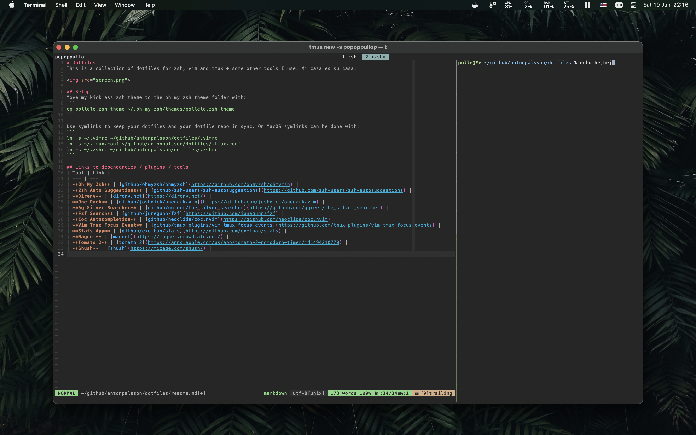

# Dotfiles
This is a collection of dotfiles for zsh, vim and tmux + some other tools I use. Mi casa es su casa.



## Setup
Move my kick ass zsh theme to the oh my zsh theme folder with:
```
cp pollele.zsh-theme ~/.oh-my-zsh/themes/pollele.zsh-theme 
```

Use symlinks to keep your dotfiles and your dotfile repo in sync. On MacOS symlinks can be done with:
```
ln -s ~/.vimrc ~/github/antonpalsson/dotfiles/.vimrc
ln -s ~/.tmux.conf ~/github/antonpalsson/dotfiles/.tmux.conf
ln -s ~/.zshrc ~/github/antonpalsson/dotfiles/.zshrc
```

## Links to dependencies / plugins / tools
| Tool | Link |
| --- | --- |
| **Oh My Zsh** | [github/ohmyzsh/ohmyzsh](https://github.com/ohmyzsh/ohmyzsh) |
| **Zsh Auto Suggestions** | [github/zsh-users/zsh-autosuggestions](https://github.com/zsh-users/zsh-autosuggestions) |
| **Direnv** | [direnv.net](https://direnv.net/) |
| **One Dark** | [github/joshdick/onedark.vim](https://github.com/joshdick/onedark.vim) |
| **Ag Silver Searcher** | [github/ggreer/the_silver_searcher](https://github.com/ggreer/the_silver_searcher) |
| **Fzf Search** | [github/junegunn/fzf](https://github.com/junegunn/fzf) |
| **Coc Autocompletion** | [github/neoclide/coc.nvim](https://github.com/neoclide/coc.nvim) |
| **Vim Tmux Focus Event** | [github/tmux-plugins/vim-tmux-focus-events](https://github.com/tmux-plugins/vim-tmux-focus-events) |
| **Stats App** | [github/exelban/stats](https://github.com/exelban/stats) |
| **Magnet** | [magnet](https://magnet.crowdcafe.com/) |
| **Tomato 2** | [tomato 2](https://apps.apple.com/us/app/tomato-2-pomodoro-timer/id1494210770) |
| **Shush** | [shush](https://mizage.com/shush/) |

